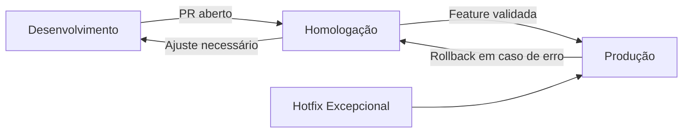

# Organização de Ambientes

## Visão Geral

Este documento descreve a organização e os fluxos de trabalho relacionados aos três ambientes principais da empresa: **Desenvolvimento**, **Homologação** e **Produção**.

O objetivo é garantir **clareza, consistência e rastreabilidade** nas etapas de desenvolvimento, testes e deploy, evitando retrabalho e reduzindo riscos de incidentes em produção.

---

## 🌱 Ambiente de Desenvolvimento

### Especificação

* **APIs envolvidas**: Dashboard, Checkout e Backoffice.
* **Execução local com Docker**:
  * Configuração via `docker-compose`.
  * APIs sobem em modo **hot reload** (`yarn dev`).
  * Redis sobe junto com a aplicação.
  * Base de dados utilizada: **sandbox**.

* **Setup inicial**:
  1. Clonar o repositório.
  2. Instalar pacotes via **Yarn**, utilizando a mesma versão de Node definida no `Dockerfile.dev` (`node:22-alpine`).
  3. Criar arquivo `.env.local` com variáveis mínimas (exemplo em `.env.example.local`).
  4. Subir containers com:

     ```bash
     docker-compose up -d
     ```

* **Bootstrap de ambiente**:
  * Função `bootstrapEnv` carrega variáveis do **AWS Secrets Manager**.
  * `.env.local` fornece credenciais locais para permitir o carregamento dos secrets.
  * Variáveis obrigatórias podem ser validadas via parâmetro `requiredKeys` no `bootstrapEnv`.
* **Exemplo de variáveis mínimas em `.env.local`**:
  ```env
  AWS_ACCESS_KEY_ID_LOCAL=...
  AWS_SECRET_ACCESS_KEY_LOCAL=...
  AWS_REGION=us-east-1
  AWS_SECRETS_MANAGER=sixbase-api-dashboard-local
  USE_SECRETS=true
  NODE_ENV=development
  ```

* **Front-end**:
  * Não utiliza Docker por enquanto.
  * Poucas variáveis de ambiente → evitar **overengineering** até ajustes estruturais futuros.

### Comandos Úteis

* **Iniciar ambiente local**:

  ```bash
  docker-compose up -d
  ```

* **Logs da aplicação**:

  ```bash
  docker logs -f sixbase-api-dashboard
  ```

* **Reinstalar dependências**:

  ```bash
  yarn clean:workspace
  ```

* **Rodar migrações no dev**:
  
  ```bash
  yarn migrate:dev
  ```

### Benefícios
* Padronização do ambiente entre desenvolvedores.
* Isolamento com containers, reduzindo conflitos locais.
* Hot reload → ciclo de desenvolvimento mais rápido.
* Consistência de variáveis via **Secrets Manager**.
* Estrutura pronta para migração simplificada para sandbox isolados.

---

## 🧪 Ambiente de Homologação

### Especificação

* **Problema anterior**: múltiplas features em homologação causavam conflitos de lógica (uma sobrescrevia a outra ou quebrava funcionalidades).
* **Nova estratégia**:
  * Cada **feature** é testada **individualmente**.
  * Criação de **branch `homolog`** no momento de abertura do PR da branch de desenvolvimento.
  * A `homolog` deve sempre partir da **última versão de produção**.
  * Se ajustes forem necessários → retornar a branch de desenvolvimento.
  * Manter `homolog` livre para próximo teste.

* **Evolução futura**:
  * Estrutura de **múltiplos ambientes sandbox**, permitindo **testes isolados e paralelos** de diferentes features.

### Benefícios

* Evita conflitos entre features em teste.
* Garante que homologação esteja sempre alinhada à última versão de produção.
* Aumenta confiabilidade dos testes antes do deploy.
* Simplifica o fluxo de correções (volta para desenvolvimento quando necessário).

---

## 🚀 Ambiente de Produção

### Especificação

* **Workflow dedicado** para subir **API** e **front-end**.
* Consumo de variáveis via **GitHub Secrets** (Secrets Manager apenas para desenvolvimento).
* Fluxo normal:
  * Desenvolvedor implementa em **desenvolvimento**.
  * Feature é validada em **homologação**.
  * Só então segue para **produção**.
* **Exceções**:
  * **Hotfix** pode ser aplicado direto em produção (somente casos críticos).
  * Se houver erro por subida incorreta → **rollback imediato** e reavaliação em homologação/desenvolvimento.
  * Mesmo ajustes simples **não devem** ser feitos diretamente em produção sem teste prévio.

### Benefícios

* Evita falhas críticas em produção.
* Rollback documentado garante rápida recuperação em incidentes.
* Maior previsibilidade e segurança no deploy.
* Fluxo disciplinado reduz risco de retrabalho e perda de tempo.

---

## 📈 Ganhos e Benefícios Gerais

1. **Clareza no fluxo de desenvolvimento**: cada ambiente tem uma função bem definida.
2. **Padronização**: todos os devs seguem o mesmo processo.
3. **Segurança**: rollback e separação clara entre ambientes reduzem riscos em produção.
4. **Escalabilidade**: estrutura preparada para suportar múltiplos sandboxes no futuro.
5. **Produtividade**: hot reload, containers e gerenciamento de secrets simplificam o dia a dia do time.
6. **Confiabilidade**: features só chegam em produção após passarem por testes controlados.

---

## 🔄 Fluxo Visual dos Ambientes



* **Linha principal**: Desenvolvimento → Homologação → Produção.
* **Rollback**: Produção → Homologação (em caso de falha).
* **Exceção**: Hotfix pode ir direto para Produção.