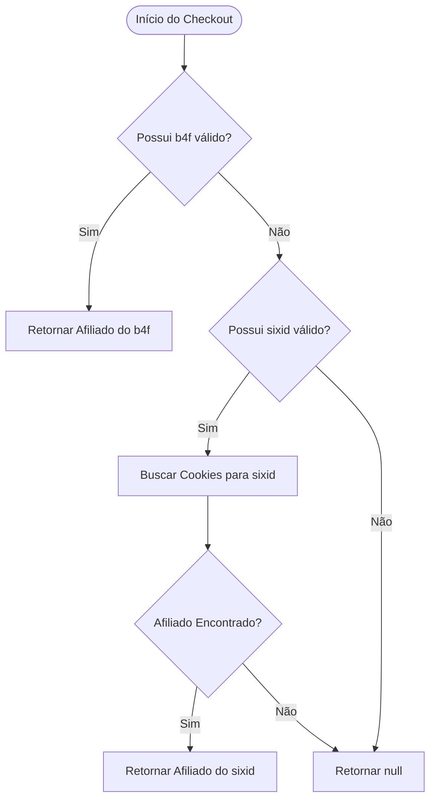

# Lógica de Atribuição de Afiliado

Este documento explica como o sistema determina qual afiliado deve receber o crédito por uma transação de checkout.

---

## Visão Geral

A lógica de atribuição é implementada em `useCases/checkout/affiliates/FindAffiliate.js`.  
Ela segue uma **ordem de prioridade estrita** para garantir que referências diretas (via links ou cupons) tenham precedência sobre rastreamento histórico (cookies).

---

## Fluxo de Prioridade

O sistema tenta encontrar um afiliado na seguinte ordem:

### 1. Atribuição Direta (`b4f`)

- **Origem**: Parâmetro `b4f` (UUID) passado para o caso de uso
- **Contexto**: Representa um clique em link direto ou um código de cupom utilizado durante a sessão
- **Comportamento**:  
  Se um afiliado válido for encontrado usando este UUID, ele é retornado imediatamente e o fluxo é encerrado

---

### 2. Rastreamento Histórico (`sixid`)

- **Origem**: Parâmetro `sixid` (ID do cookie) passado para o caso de uso
- **Contexto**: Representa uma sessão rastreada anteriormente ou um cookie de longo prazo
- **Comportamento**:  
  Caso não exista atribuição direta via `b4f`, o sistema busca cookies associados ao `sixid`.  
  Se um afiliado estiver vinculado a esses cookies, ele é retornado

---

### 3. Sem Atribuição

- **Comportamento**:  
  Caso nenhum dos métodos anteriores retorne um afiliado válido, o sistema retorna `null`, indicando que não houve atribuição de afiliado para a transação

---

## Diagrama Lógico

---

## Detalhes Técnicos

- **Arquivo responsável**: `useCases/checkout/affiliates/FindAffiliate.js`
- **Parâmetros-chave**:
  - `b4f`: UUID do Afiliado (atribuição direta)
  - `sixid`: ID do Cookie de Rastreamento (fallback)

---

## Observações Importantes

- A lógica é **determinística**: sempre a mesma entrada gera o mesmo resultado
- A atribuição direta **sempre sobrescreve** o rastreamento histórico
- Alterações nessa lógica impactam diretamente:
  - Comissões
  - Relatórios de vendas
  - Pagamentos a afiliados

---

> ⚠️ Qualquer alteração neste fluxo deve ser cuidadosamente avaliada e documentada, pois afeta diretamente o modelo financeiro da plataforma.