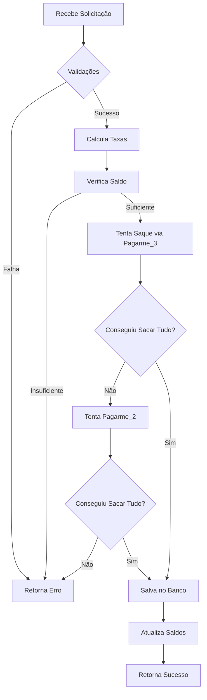

# Request Withdrawal Lambda

Lambda function para processar solicitações de saque de usuários.

## 🎯 Funcionalidades

- ✅ Processamento de saques via Pagarme
- ✅ Modo Sandbox para desenvolvimento e testes
- ✅ Validações de saldo e regras de negócio
- ✅ Suporte a múltiplas contas Pagarme
- ✅ Tratamento de saldo retido (withheld balance)
- ✅ Integração com saldo de referência

## 🏗️ Arquitetura

### Estrutura de Pastas

```
requestWithdrawal/
├── config/              # Configurações (DynamoDB, etc)
├── database/            # Modelos e repositórios Sequelize
│   ├── models/
│   └── repositories/
├── services/            # Serviços externos
│   ├── PaymentProvider.mjs        # Interface base
│   ├── SandboxPaymentProvider.mjs # Implementação sandbox
│   ├── Pagarme.mjs                # Integração Pagarme
│   └── HTTPClient.mjs
├── useCases/            # Casos de uso
│   ├── CreateWithdrawal.mjs
│   ├── CalculateWithdrawalFeesAndAmounts.mjs
│   └── WithheldBalance.mjs
├── status/              # Enums de status
├── types/               # Tipos e constantes
├── utils/               # Utilitários
├── __tests__/           # Testes
│   ├── unit/
│   └── integration/
├── index.mjs            # Handler principal
└── test-sandbox.mjs     # Script de teste em sandbox
```

### Padrões Implementados

- **Injeção de Dependências**: Todos os serviços externos são injetados via construtor
- **Strategy Pattern**: Interface `PaymentProvider` com múltiplas implementações
- **Repository Pattern**: Acesso ao banco de dados via repositórios
- **Factory Pattern**: Criação de providers baseado no ambiente

## 🚀 Instalação

```bash
npm install
```

### Dependências de Desenvolvimento

```bash
npm install --save-dev @jest/globals jest
```

## 🔧 Configuração

### Variáveis de Ambiente

#### Produção

```bash
# Database
MYSQL_HOST=your-host
MYSQL_PORT=3306
MYSQL_DATABASE=your-db
MYSQL_USERNAME=your-user
MYSQL_PASSWORD=your-password

# Pagarme
PAGARME_URL=https://api.pagar.me/1
PAGARME_PASSWORD_2=sk_xxxx
PAGARME_PASSWORD_3=sk_xxxx

# Mode
SANDBOX_MODE=false
```

#### Sandbox/Desenvolvimento

```bash
# Database (mesmas configurações)
MYSQL_HOST=localhost
MYSQL_PORT=3306
MYSQL_DATABASE=test_db
MYSQL_USERNAME=test_user
MYSQL_PASSWORD=test_password

# Modo Sandbox (não precisa configurar chaves reais)
SANDBOX_MODE=true

# As chaves abaixo podem ser valores fictícios em sandbox
PAGARME_URL=http://localhost
PAGARME_PASSWORD_2=sandbox_key
PAGARME_PASSWORD_3=sandbox_key
```

## 🧪 Modo Sandbox

O modo sandbox permite testar a função sem fazer chamadas reais à Pagarme.

### Benefícios

- ✅ Não depende de APIs externas
- ✅ Testes mais rápidos
- ✅ Não consome créditos/saldo das APIs
- ✅ Dados salvos normalmente no banco
- ✅ Ideal para desenvolvimento e testes

### Como Usar

1. Configure a variável de ambiente:
```bash
export SANDBOX_MODE=true
```

2. Execute normalmente:
```bash
node index.mjs
```

### Comportamento no Sandbox

- `getBalance()`: Retorna saldo padrão de R$ 10.000,00 (configurável)
- `requestWithdrawal()`: Simula saque com UUID único
- Todas as operações são registradas no banco de dados normalmente
- Logs incluem marcador `[SANDBOX]` para identificação

### Configurando Saldos Mockados

```javascript
import { SandboxPaymentProvider } from './services/SandboxPaymentProvider.mjs';

const provider = new SandboxPaymentProvider({
  'recipient_123': 500000,  // R$ 5.000,00
  'recipient_456': 1000000, // R$ 10.000,00
});

// Ou dinamicamente
provider.setBalance('recipient_789', 250000); // R$ 2.500,00
```

## 🧪 Testes

### Executar Todos os Testes

```bash
npm test
```

### Testes Unitários

```bash
npm run test:unit
```

### Testes de Integração

```bash
npm run test:integration
```

### Cobertura de Código

```bash
npm run test:coverage
```

### Modo Watch (desenvolvimento)

```bash
npm run test:watch
```

## 📝 Uso

### Lambda Handler

```javascript
import { handler } from './index.mjs';

const event = {
  Records: [{
    body: JSON.stringify({
      id_user: 123,
      amount: 100.00  // R$ 100,00
    })
  }]
};

const result = await handler(event);
// Retorna: { statusCode: 200, body: {...}, mode: 'sandbox' | 'production' }
```

### Uso Programático

```javascript
import { CreateWithdrawal } from './useCases/CreateWithdrawal.mjs';
import { SandboxPaymentProvider } from './services/SandboxPaymentProvider.mjs';
import { Database } from './database/sequelize.mjs';

// Modo Sandbox
const sandboxProvider = new SandboxPaymentProvider();
const database = await new Database(config).connect();

const createWithdrawal = new CreateWithdrawal({
  Database: database,
  pagarmeProviders: [sandboxProvider, sandboxProvider],
  isSandbox: true,
});

const result = await createWithdrawal.execute({
  id_user: 123,
  amount: 100,
});

console.log(result);
// {
//   success: true,
//   withdrawals: [...],
//   message: 'Saque solicitado com sucesso'
// }
```

## 🔍 Validações

A função realiza as seguintes validações:

1. ✅ Usuário possui conta bancária cadastrada
2. ✅ Valor mínimo de saque
3. ✅ Usuário não está bloqueado
4. ✅ Não há saque pendente (se `lock_pending` ativo)
5. ✅ Não excede limite mensal (para não-empresas)
6. ✅ Saldo suficiente (considerando saldo retido)

## 🎨 Melhorias Implementadas

### Antes
- ❌ Dependência direta de APIs externas
- ❌ Difícil de testar
- ❌ Sem separação clara de responsabilidades
- ❌ Sem testes automatizados

### Depois
- ✅ Modo sandbox independente de APIs
- ✅ Injeção de dependências
- ✅ Interface clara para providers
- ✅ Testes unitários e de integração
- ✅ Melhor logging e rastreabilidade
- ✅ Retorno estruturado com informações detalhadas

## 📊 Fluxo de Saque



## 🔒 Segurança

- Validação de saldo antes de processar
- Transações de banco de dados com commit/rollback
- Lock otimista em saldos de referência
- Logs detalhados para auditoria

## 🐛 Debug

### Logs em Sandbox

```bash
[SANDBOX] Getting balance for recipient: recipient_123
[SANDBOX] Balance: 10000
[SANDBOX] Requesting withdrawal for recipient: recipient_123 amount: 1000
[SANDBOX] Withdrawal response ->  { id: 'uuid...', status: 'pending', ... }
[SANDBOX] Processing withdrawal for user -> 123
[SANDBOX] Withdrawal created successfully
```

### Histórico de Saques (apenas sandbox)

```javascript
const provider = new SandboxPaymentProvider();
// ... faz alguns saques ...
const history = provider.getWithdrawalHistory();
console.log(history);
```

## 📈 Próximos Passos

- [ ] Adicionar testes E2E com banco de dados real
- [ ] Implementar retry logic para APIs externas
- [ ] Adicionar métricas e monitoring
- [ ] Suporte a webhooks de callback
- [ ] Dashboard de status de saques

## 🤝 Contribuindo

1. Adicione testes para novas funcionalidades
2. Mantenha a compatibilidade com modo sandbox
3. Documente mudanças significativas
4. Execute os testes antes de commitar: `npm test`

## 📄 Licença

ISC

